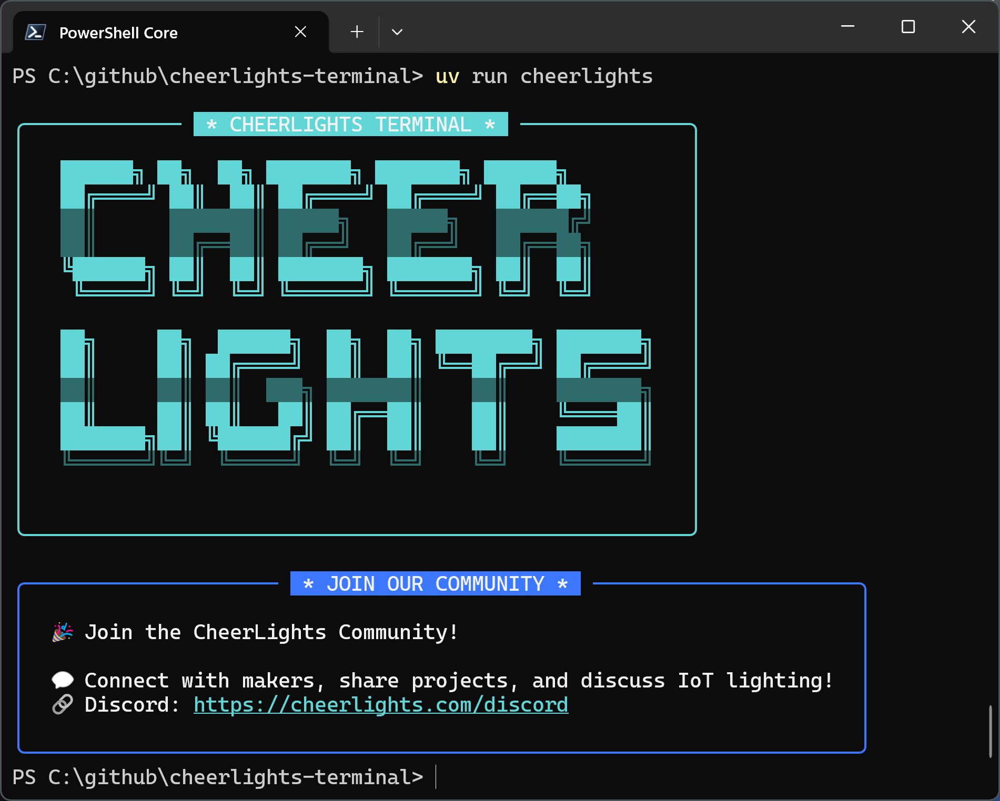

# CheerLights Terminal

A beautiful terminal interface for the CheerLights IoT project, featuring ASCII art and community integration.



## About

CheerLights Terminal is a command-line application that connects you to the CheerLights community - a global network of synchronized IoT lights that change color together. This terminal interface provides an elegant way to interact with the CheerLights ecosystem while displaying beautiful ASCII art.

## Features

- **ASCII Art Display**: Beautiful terminal-based CheerLights logo
- **Community Integration**: Direct links to join the CheerLights Discord community
- **Modern Python**: Built with modern Python packaging using `uv`
- **Cross-platform**: Works on Windows, macOS, and Linux

## Installation

This project uses `uv` for dependency management. Make sure you have `uv` installed:

```bash
# Install uv if you haven't already
curl -LsSf https://astral.sh/uv/install.sh | sh
```

Then install and run the project:

```bash
# Clone the repository
git clone <repository-url>
cd cheerlights-terminal

# Install dependencies
uv sync

# Run the application
uv run cheerlights
```

## Usage

Simply run the command to display the CheerLights terminal interface:

```bash
uv run cheerlights
```

The application will display:
- The CheerLights ASCII art logo
- Community information and Discord link
- Connection details for makers and IoT enthusiasts

## Join the Community

🎭 **Join the CheerLights Community!**

💬 Connect with makers, share projects, and discuss IoT lighting!  
🔗 **Discord**: https://cheerlights.com/discord

## Development

This project is structured as a modern Python package:

```
src/
└── cheerlights_terminal/
    ├── __init__.py
    ├── main.py
    ├── cheerlights.py
    └── ascii_art.py
```

### Project Structure

- `main.py`: Entry point for the application
- `ascii_art.py`: Contains the ASCII art definitions
- `cheerlights.py`: Core CheerLights functionality
- `pyproject.toml`: Modern Python project configuration
- `uv.lock`: Locked dependencies for reproducible builds

## License

This project is licensed under the terms specified in the LICENSE file.

## Contributing

Contributions are welcome! Please feel free to submit pull requests or open issues for any improvements or bug fixes.

---

**CheerLights** is a project by Hans Scharler that synchronizes colored lights around the world. Learn more at [cheerlights.com](https://cheerlights.com).
